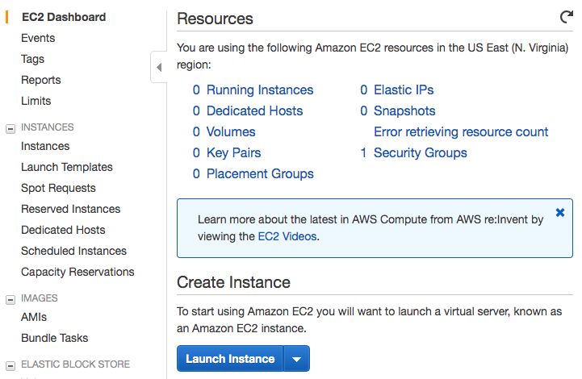
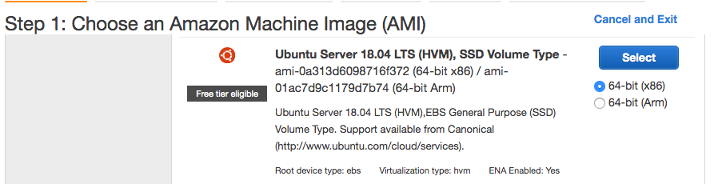
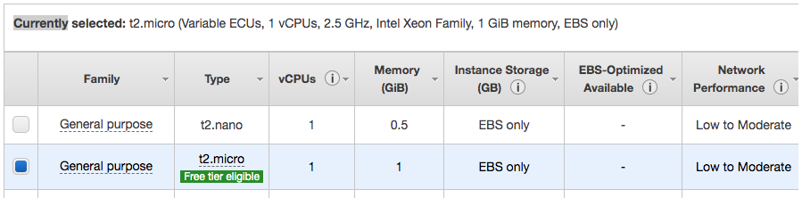
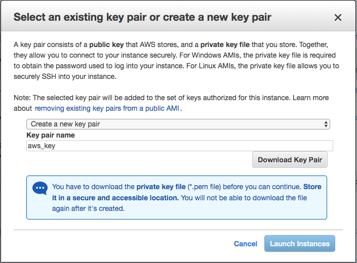
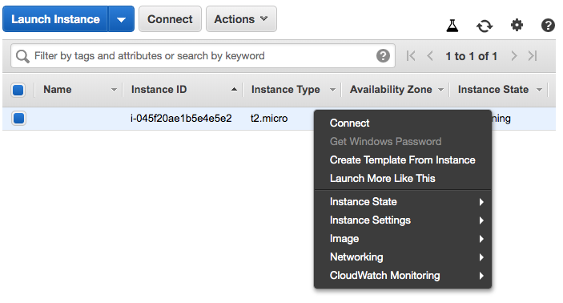
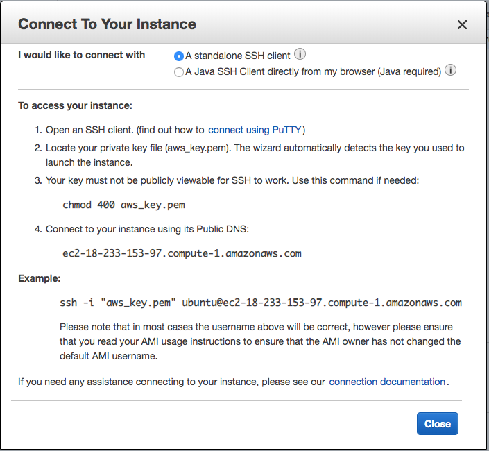
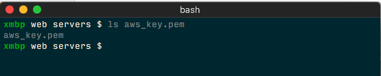
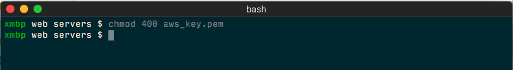
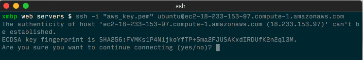
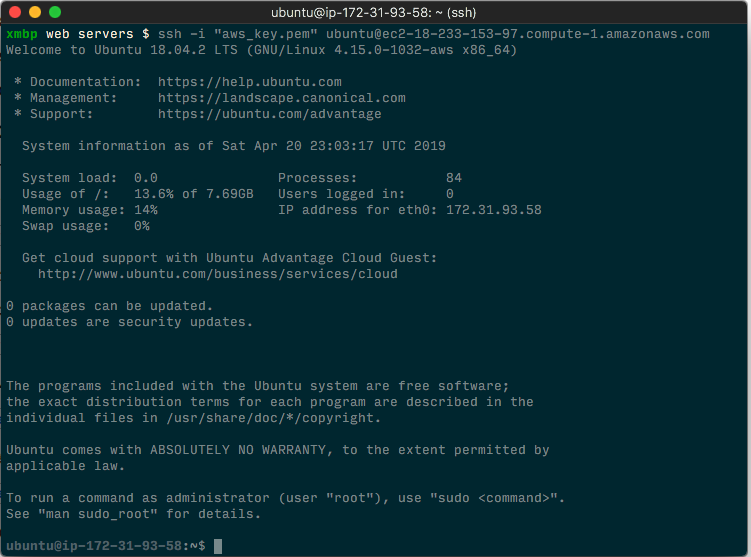

# Launch AWS Instance

1. Open the Amazon EC2 console at https://console.aws.amazon.com/ec2.

2. Click **Lanch Instance**

3. In **Step 1**: Select *Ubuntu Server 18.04 LTS*:

4. In **Step 2**: Make sure to check the _t2.micro_ Instance Type:

5. Click in **Review and Launch**

6. After reviewing the machine settings, click **Launch**.

7. In the _Select an existing key pair or create a new key pair_ modal select **Create a new key pair** in the first dropdown and type **aws_key** in the _key pair name_ textfield:

8. Download the key pair file clicking the _Download Key Pair_ button. Save the file in a secure location.

9. Click **Launch Instance**

10. Click **View Instances** or go to https://console.aws.amazon.com/ec2/v2/home?#Instances

### Connecting to the Instance

In order to connect the new instance the key pair file downloaded in the step 8 above is required.

1. Right click your new machine in the Instance list on aws console:

2. Click **Connect**.

3. Copy the example to connect using ssh:

4. Open a Terminal/Command Prompt program and go to the folder where you save the key pair file:

5. Give the 400 octal permission to the key pair file, executing **chmod 400 aws_key.pem** (Only on Linux systems):

6. Paste or type the command indicated in step 3 and hit Enter:

7. Type **yes** if prompted with a yes/no question, the prompt will change indicating you are connected to the aws instance:

