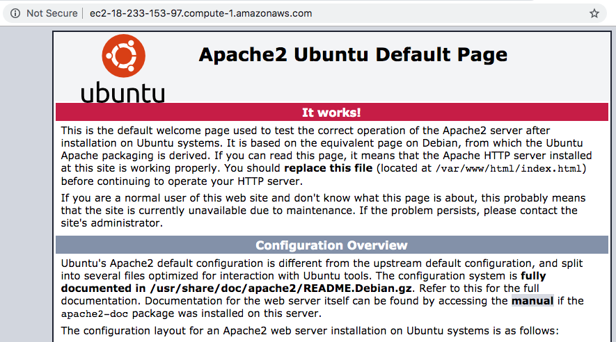

# LAMP Installation

1. Connect to your aws instance following the instructions given [here](instance.md#connecting-to-the-instance)

2. Update your system running:

```Linux
   sudo apt update && sudo apt upgrade
```

 Type `Y` if required for confirmation during the update process.

 3. Ubuntu/Debian comes with a tool called `tasksel` to allow the installation of multiple related packages as a coordinated task onto the system. Install `tasksel` running:

```bash
   sudo apt install tasksel
```

   Type `Y` if required for confirmation during the update process.

4. Install lamp-server using `tasksel` running:

```bash
   sudo tasksel install lamp-server
```

5. Secure the MySQL installation running:

```bash
   sudo mysql_secure_installation
```

   Follow the steps provided in the standard output making sure you select a STRONG password. Answer yes (y) for all the yes/no questions asked.

6. To verify that mysql was installed successfully run:

```bash
   sudo mysql -u root -p
```

  And provide the given password in the previous step followed by Enter. The mysql prompt is shown:


7. Type **quit;** to go back to the Terminal


### Enable Http Inbound connections

1. Go to the Instance List on aws console and select the proper instance.

2. Under the Description tab, there is a entry named **Public DNS (IPv4)**, copy that domain.

3. Under the Description tab, there is a entry named **Security groups**:


4. Click the first link: `launch-wizard-1`. Then click the **Inbound** tab:


5. Click **Edit**.

6. Click **Add Rule**.

7. In the first dropdown of the new created line, select **HTTP**:


8. Click **Save**.

9. Open a web browser and navigate to the DNS copied on step 2. You should see the Apache2 default page:




