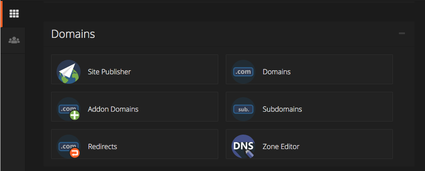
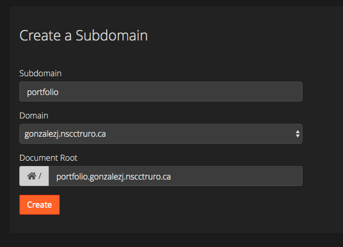
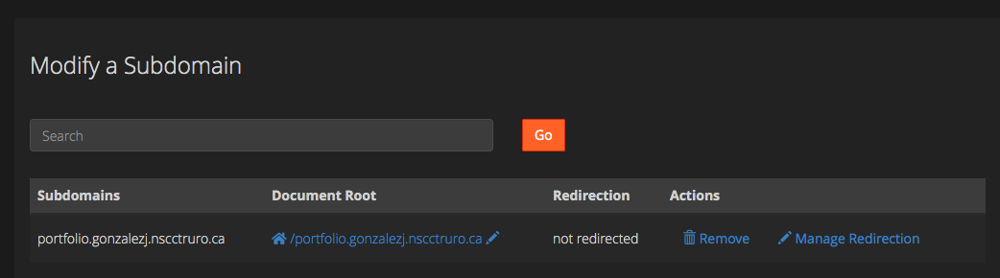
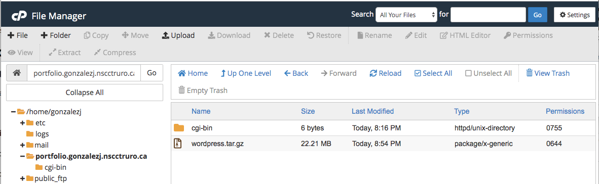
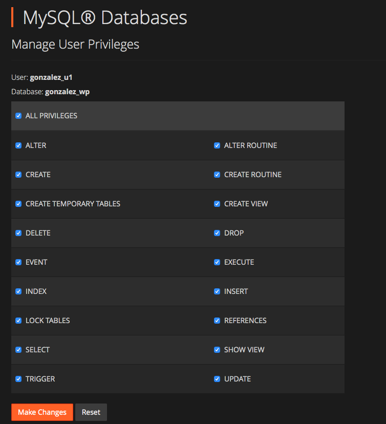
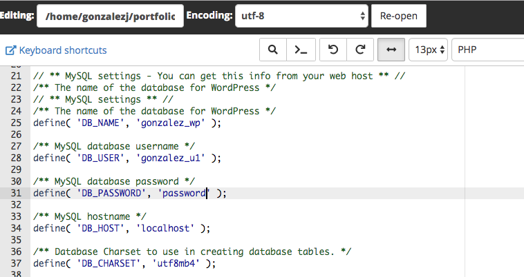
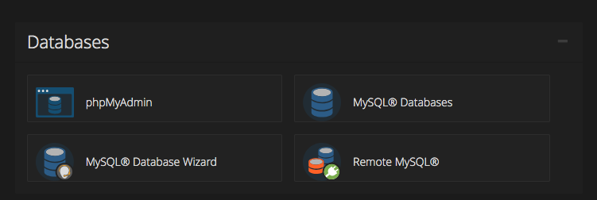
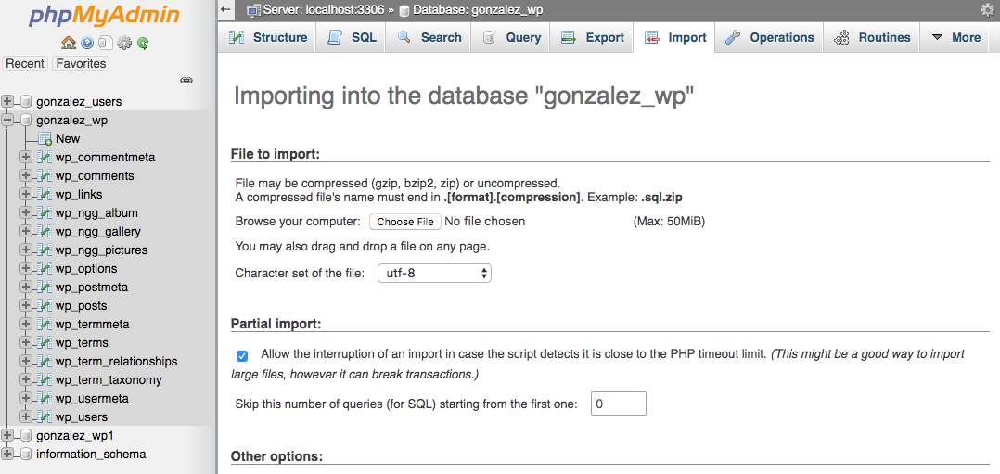

# WordPress Migration to CPanel

### Set Up cPanel

1. Open your CPanel console and create a subdomain clicking the **Subdomains** link:



2. Type in the new subdomain:



3. Click **Create**.

4. Click **Go Back**.

5. Scroll down to the `Modify a Subdomain` section and click the `Document Root` for the new subdomain:



You will see the `cPanel File Manager` window.

### Backing up

1. Open a ssh connection to your aws instance.

2. Back up your MySQL wordpress database using the following command:

```bash
   mysqldump --add-drop-table -h localhost -u wordpressuser -p wordpress | sed 's,http://ec2-18-233-153-97.compute-1.amazonaws.com,http://portfolio.gonzalezj.nscctruro.ca,g' > ~/wordpress-database.sql
```

The following values varies depending on the installation:
- `wordpressuser` is the MySQL user with permissions to access the WordPress database.
- `wordpress` is the name of the WordPress database.
- `http://ec2-18-233-153-97.compute-1.amazonaws.com` is the old url used in the WordPress site.
- `http://portfolio.gonzalezj.nscctruro.ca` is the new url for the WordPress site. The subdomain created in cPanel.

Type the MySQL password for `wordpressuser` and hit Enter.

3. Back up your WordPress folder using the command:

```bash 
   cd /var/www/html && tar cvf - * | gzip -9 - > ~/wordpress.tar.gz
```

4. Move the backup files to your computer using `scp`.

- Open a new terminal window.
- Using the same key file used to connect your aws instance using SSH, copy the MySQL backup file:

```bash
   scp -i aws_key.pem ubuntu@ec2-18-233-153-97.compute-1.amazonaws.com:~/wordpress-database.sql .
```

- Copy the wordpress compressed file as well:

```bash
   scp -i aws_key.pem ubuntu@ec2-18-233-153-97.compute-1.amazonaws.com:~/wordpress.tar.gz .
```


### Moving to cPanel

1. Open the navigator and go to your subdomain Folder Manager.

2. Upload the compressed file in the root directory:



3. Select the file `wordpress.tar.gz` and click **Extract**.

4. Click **Extract File(s)**.

5. Wait the process to complete and click **Close** in the `Extraction Results` modal.

6. Create new MySQL database and user using cPanel:

- Create a new MySQL database.

- Create a new MySQL user.

- Add the user to the database, checking ALL PRIVILEGES:



7. In cPanel File Manager, select the file `wp-config.php` and click **Edit**.

8. Click **Edit** again.

9. Edit the lines 25, 28 and 31 to update the database name, user name and password:



10. Click **Save Changes**

11. Click **Close**

12. Go to cPanel Database section and click **phpMyAdmin**



13. In the left panel, select your new database.

14. Select the **Import** tab:



15. Click the **Choose File** button and select the file `wordpress-database.sql`.

16. Click **Go**

17. Access your WordPress site using your new subdomain!
