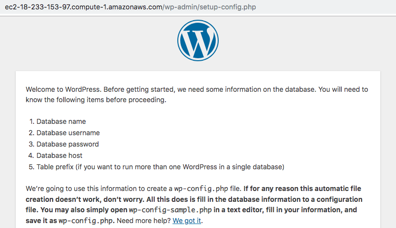
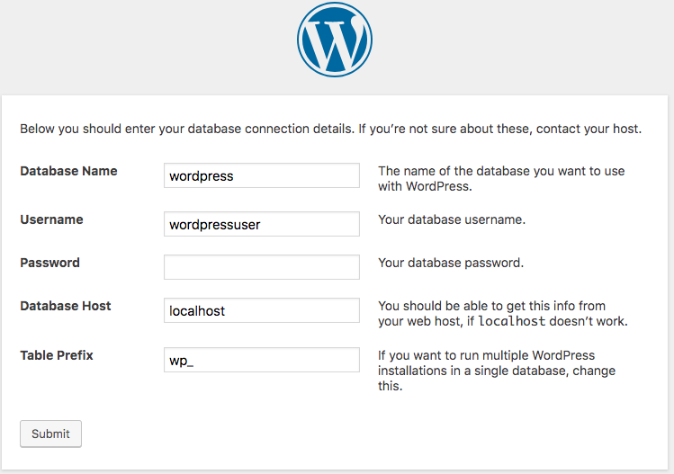
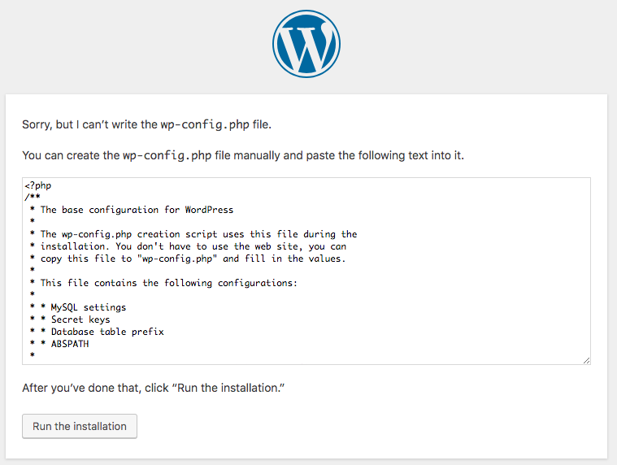
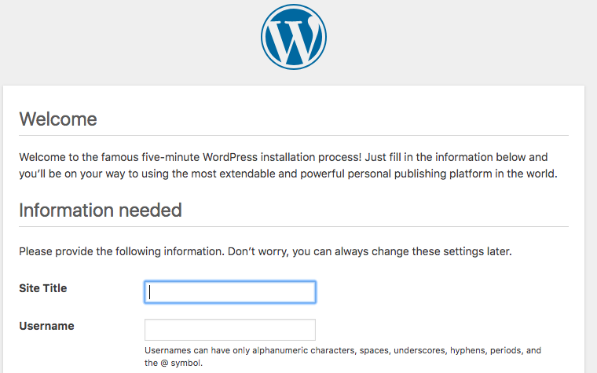
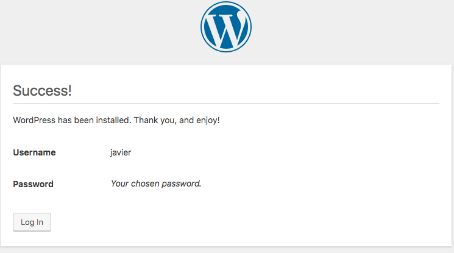
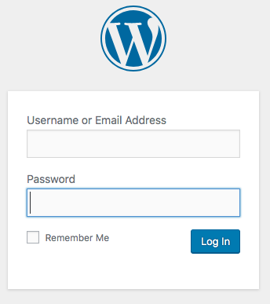
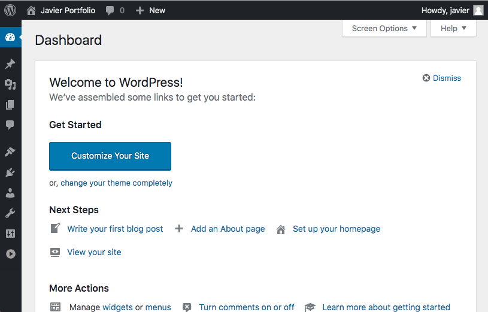

# WordPress Installation

### Create a MySQL database and user for WordPress

1. Access MySQL commnad-line client running in the terminal:

```bash
sudo mysql -u root -p
```

You should see the command-line client:


2. Create a separate database named `wordpress` running the following MySQL command:

```sql
   create database wordpress;
```

3. Create a new MySQL user account to operate the new database running the following MySQL command:

```sql
   create user wordpressuser@localhost identified by 'ChangeThisPassword';
```

This account will create a user named `wordpressuser` with `ChangeThisPassword` as password. YOU SHOULD CHANGE THIS PASSWORD FOR ANOTHER MORE SECURE PASSWORD.

4. Allow the new user access the new database running:

```sql
   grant all privileges on wordpress.* to wordpressuser@localhost; flush privileges;
```

5. Exit the command-line client running:

```sql
   exit
```

6. If you open the MySQL command-line client again, but using the new user:

```bash
sudo mysql -u root -p
```

You should be able to login using your password:


Type `exit` to close the command-line client.

### Download WordPress

1. Download the latest WordPress version running:

```bash
   wget http://wordpress.org/latest.tar.gz
```

2. Extract the files using:

```bash
   tar xzvf latest.tar.gz
```

3. Remove the current content of the `/var/www/html` folder using:

```bash
   sudo rm -rf /var/www/html/*
```

4. Copy the content of the extracted folder to `/var/www/html` using:

```bash
   sudo cp -r wordpress/* /var/www/html
```

### Setting up WordPress

1. Access your website in your browser, you should see a page like the following:



2. Click **Let's go!**.

3. Fill all the fields out, using `wordpress` as database name, `wordpressuser` as username and your password:



Database host and table prefix could be left with the default values.

4. Click **Submit**
   
   If you get a message saying the connection to the database was not successfull, verify your username and password.

5. You will see the following page:



6. Copy the content of the textarea.

7. Using your terminal, write the file `wp-config.php` to `/var/www/html`.

8. Click **Run the installation**, you will see the Welcome page:



9. Type in the site title, username and password for accessing the WordPress dashboard site, and email. Click **Install WordPress**

10. You will see the Success page.



11. Click **Log In** to access the WordPress dashboard site.

12. Type in the username and password selected in the login page:



13. The Wordpress dashboard is shown:


