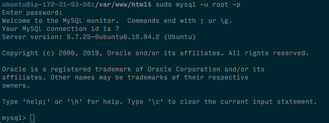
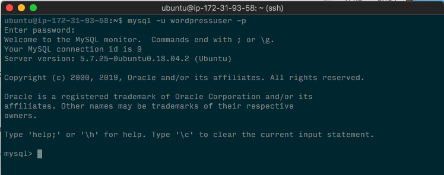

# WordPress Installation

### Create a MySQL database and user for WordPress

1. Access MySQL commnad-line client running in the terminal:

```bash
sudo mysql -u root -p
```

You should see the command-line client:



2. Create a separate database named wordpress running the following MySQL command:

```sql
   create database wordpress;
```

3. Create a new MySQL user account to operate the new database running the following MySQL command:

```sql
   create user wordpressuser@localhost identified by 'ChangeThisPassword';
```

This account will create a user named `wordpressuser` with `ChangeThisPassword` as password. YOU SHOULD CHANGE THIS PASSWORD FOR ANOTHER MORE SECURE PASSWORD.

4. Allow the new user access the new database running:

```sql
   grant all privileges on wordpress.* to wordpressuser@localhost; flush privileges;
```

5. Exit the command-line client running:

```sql
   exit
```

6. If you open the MySQL command-line client using the new user:

```bash
sudo mysql -u root -p
```

You should be able to login using your password:



Type `exit` to close the command-line client.


